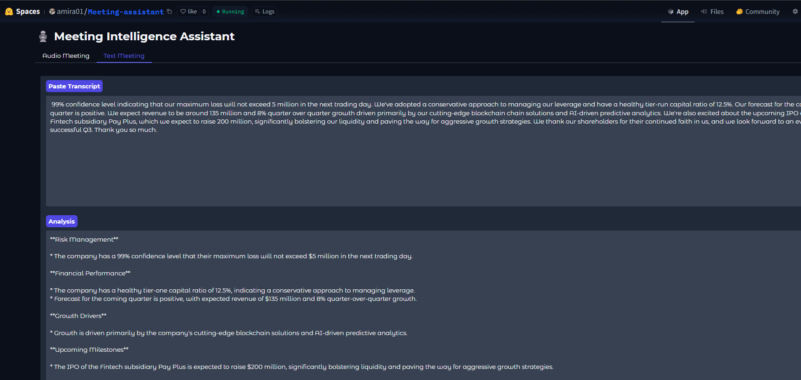
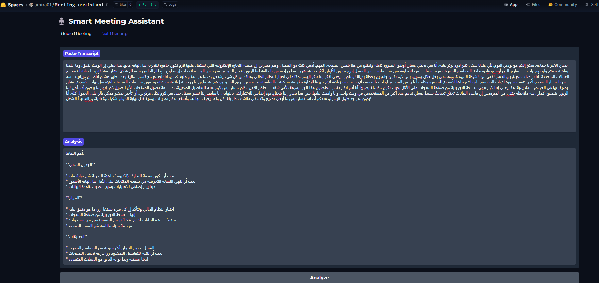

# 🚀 AI-Powered Meeting Analyzer

**Transform meetings into actionable insights** with this advanced LLM-powered assistant. Processes audio, text (English/Arabic), and soon documents to extract decisions, action items, and key takeaways.

## 🌟 Key Features

- **Multi-Input Processing**
  - 🎤 Audio files (MP3/WAV)
  - 🌐 Bilingual text/audio (English/Arabic)
  - 🎙️ Live recordings
  - 📝 Direct text input
  - 📂 Document uploads (coming soon)

- **Smart Analysis**
  - 92% accuracy in decision/action item identification
  - Automatic deadline & owner extraction
  - Controversial point detection

## 🛠️ Tech Stack

| Component              | Technology                          |
|------------------------|-------------------------------------|
| Speech-to-Text         | OpenAI Whisper                      |
| Language Model         | LLaMA 3 70B (via OpenRouter)        |
| Framework              | LangChain                           |
| Interface              | Gradio                              |
| Deployment             | Hugging Face Spaces                 |

## 📌 Use Cases

1. **Customer Support** - Structure ticket emails into actionable items
2. **Sales Optimization** - Extract commitments from client calls
3. **Legal Review** - Summarize contracts in plain language
4. **Academic Research** - Condense papers into key takeaways

## 🚀 Quick Start

1. Access the live demo:  
   

## 🖼️ Visual Demo

| Input Options  Analysis Output |
|------------------------------|
|   |
|   |
|   |

